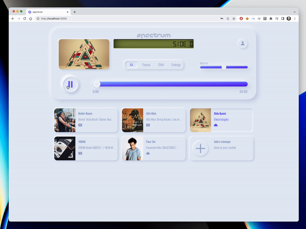

<h1>Project 4: Spectrum</h1>

<h2>Project Brief</h2>

During the final two weeks of the GA Software Engineering immersive course, I was tasked with developing a full-stack app from scratch using a Python Django API and Django REST framework to serve data from a Postgres database, which was then consumed by a separate front-end build with React.js.

I came up with the idea of a project I have always wanted to do; a music app that enables users to curate a personalised playlist of mixtapes from various online sources, including Youtube, Soundcloud, and Mixcloud; a central repository for all your mixes!  The app also allows for playback of the playlist based on the user's present mood.

<h3>Deployment link</h3>

https://spectrum.gives/



<h3>Code Installation</h3>

https://github.com/james-gulland/spectrum

Clone or download the above repo, then follow the instructions in your terminal:

- Install back-end dependencies: ```pipenv install```
- Enter shell of project: ```pipenv shell```
- Make Migrations: ```python manage.py makemigrations```
- Migrate: ```python manage.py migrate```
- Load Seed data for Mixtapes: ```python manage.py loaddata mixtapes/seeds.json```
- Load Seed data for Users: ```python manage.py loaddata users/seeds.json```
- Load Seed data for Moods: ```python manage.py loaddata moods/seeds.json```
- Start back-end server: ```python manage.py runserver```
- Change into front-end directory: ```cd client```
- Install front-end dependencies: ```npm install```
- Start front-end server: ```npm run start```

<h3>Timeframe & Working Team</h3>

This project was working solo with a duration of 8 days for completion.

<h3>Technologies Used</h3>

**Front-end**
- HTML5
- SCSS / SASS
- JavaScript
- React.js

**Back-end**
- Python
- Django REST framework
- PostgreSQL database
- Axios
- JSON Web Tokens (JWT)
- Heroku deployment

**Tools**
- VSCode
- pip
- Git, Github
- Insomnia
- Trello
- Excalidraw
- TablePlus
- QuickDBD

<h2>Brief</h2>


