<h1>Project 4: Spectrum</h1>

<h2>Project Brief</h2>

During the final two weeks of the GA Software Engineering immersive course, I was tasked with developing a full-stack app from scratch using a Python Django API and Django REST framework to serve data from a Postgres database, which was then consumed by a separate front-end build with React.js.

I came up with the idea of a project I have always wanted to do; a music app that enables users to curate a personalised playlist of mixtapes from various online sources, including Youtube, Soundcloud, and Mixcloud; a central repository for all your mixes!  The app also allows for playback of the playlist based on the user's present mood.

<h3>Deployment link</h3>

https://spectrum.gives/


<h3>Code Installation</h3>

https://github.com/james-gulland/spectrum

Clone or download the above repo, then follow the instructions in your terminal:

- Install back-end dependencies: ```pipenv install```
- Enter shell of project: ```pipenv shell```
- Make Migrations: ```python manage.py makemigrations```
- Migrate: ```python manage.py migrate```
- Load Seed data for Mixtapes: ```python manage.py loaddata mixtapes/seeds.json```
- Load Seed data for Users: ```python manage.py loaddata users/seeds.json```
- Load Seed data for Moods: ```python manage.py loaddata moods/seeds.json```
- Start back-end server: ```python manage.py runserver```
- Change into front-end directory: ```cd client```
- Install front-end dependencies: ```npm install```
- Start front-end server: ```npm run start```

<h3>Timeframe & Working Team</h3>

This project was working solo with a duration of 8 days for completion.

<h3>Technologies Used</h3>

**Front-end**
- HTML5
- SCSS / SASS
- JavaScript
- React.js

**Back-end**
- Python
- Django REST framework
- PostgreSQL database
- Axios
- JSON Web Tokens (JWT)
- Heroku deployment

**Tools**
- VSCode
- pip
- Git, Github
- Insomnia
- Trello
- Excalidraw
- TablePlus
- QuickDBD

<h2>Brief</h2>

- Build a full-stack application by making your own backend and your own front-end
- Use a Python Django API using Django REST Framework to serve your data from a Postgres database
- Consume your API with a separate front-end built with React
- Be a complete product which most likely means multiple relationships and CRUD functionality for at least a couple of models
- Implement thoughtful user stories/wireframes that are significant enough to help you know which features are core MVP and which you can cut
- Have a visually impressive design to kick your portfolio up a notch and have something to wow future clients & employers. ALLOW time for this.
- Be deployed online so it's publicly accessible.

<h2>Planning</h2>

Right from the outset, I already knew the subject matter that I wanted to cover!  I always wanted to create a music app where I can bring together all my favourite mixtapes from around the web, from different sources, such as Soundcloud and Youtube.  As far as I am aware, there is no such product offering that does this.  And this project gave me the perfect opportunity to do that.

**Step 1: Exploring technical feasibility of the project**

I first started by exploring the technical feasibility of what I wanted to do, by looking into the Soundcloud and Youtube APIs as a starting point.  The first stumbling block occurred when I found out that Soundcloud has closed their API access for developers (!):

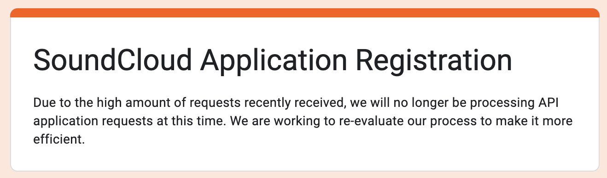

This was annoying.  The good news is that Youtube API was available to use, with fairly comprehensive documentation.  On further investigation, I also found a React package called React-Player, which would be able to handle the playback of multiple sources (Youtube, Soundcloud etc) which would make my life easier, and also found a work-around for Soundcloud, by instead tapping into their Widget API rather than the core API access - whilst this meant I could only get read access to track information, this was all I needed.  I quickly found out that the React-Player would handle playback information but not track metadata, so I would need to use the Youtube and Soundcloud Widget APIs to supplement this data.  

As a fallback plan, if I ran into any technical challenges, I could always resort to having the 3rd party widgets (i.e. Soundcloud and Youtube widgets) added as separate tracks to play on the app, but obviously I would much prefer to have central control over the playback, as having a number of widgets on the page at once is not highly performant, especially on mobile.

Sam, our instructor, also advised me to check compatibility when deploying to Heroku - to make sure there are no issues.  And thankfully, I found some examples of sites deployed to Heroku using Youtube to play videos, so at this point, I was satisfied this project was technically possible!

**Step 2:  Formulating the concept**

My next step was to sketch out the vision in Excalidraw.  I took a lot of inspiration from an app I used to use many years ago called Winamp, that used to play mp3s.  I was also quite tired of every music app trying to copy Spotify, so I decided to do a modern take on a retro app.

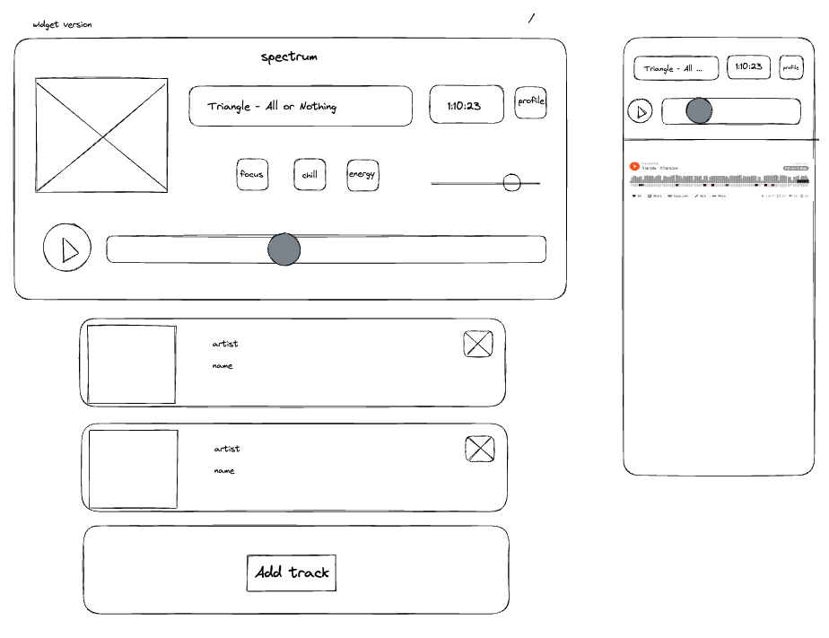

It would show album art, and the video if it were a youtube link, and there would be a large emphasis on the progress bar, so it would be easy to seek through a 1hr+ mix.  Pressing the mood buttons would filter the playlist below the controls.

Adding tracks would involve adding the mixtape URL, at which point the APIs would fetch the track metadata to pre-populate the fields.  The below shows how I might split up the JSX into the respective containers and divs:

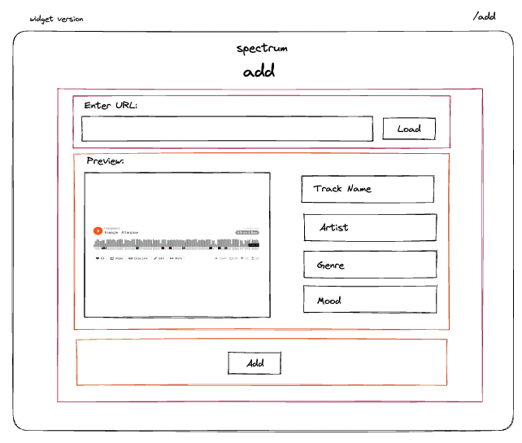

**Step 3: Creating the Database Diagram**

Based on the technical spike and the wireframes, I then started to map out what data I will need and how to structure it.  I created a data diagram of the relationships of the data, using a tool called Quick DBD, which would help inform the creation of the data models / schemas:

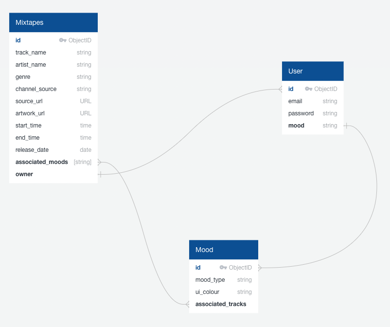

I added the concept of applying ‘moods’ to ‘mixtapes’ - i.e. a many-to-many relationship, whereas a user will only ever have one mood at a time, i.e. one-to-many.  I didn't want to over-complicate the back-end, as we only had a week to polish the product and it was a solo project, so I kept the structure quite simple.  I started off making it quite complex, but instead preferred to simplify to improve overall quality of the end product.

**Step 4: Defining the MVP**

For the minimum product, I wanted at the very least to be able to play Soundcloud tracks and be able to store them under a profile, ideally using React-Player for playback, but would fall back to importing separate widgets for each track on the page if not.  I wanted to create a delightful user experience using best-in-case UI components and visuals.

A best case scenario would be the ability to playback both Soundcloud and Youtube tracks, stored under your profile, be able to edit the track data before storing, and then be able to filter down the mixtapes by mood.

Long-term goals would be to add more compatibility for other sources, including Mixcloud, a waveform generator (to visually represent the sound), be able to customise UI depending on different colours (and potentially tying to when changing mood!)

I had to be realistic though, as I only had 1 week on a full-stack project, so I would have to park the long-term goals for another time, but bear in mind how I might build the back-end and front-end out to accommodate these in the future.

<h2>Build Process</h2>

**Day 1: setting up the dev environment**

Initially, I spent the first day setting up the development environment and finessing some of the detail around the wireframe and the data models, once I had sign-off from the instructors.  This involved setting up a new git repo, syncing it locally, installing Django framework, and setting up a PostgreSQL database.  In the meantime, I also elaborated on the wireframes to include all user journeys and updated the ERD to highlight the data models required and their associated relationships.

Once I was confident in the data that was needed for the project, I created a basic app and associated model for the mixtapes, created the database, managed the migrations, created a superuser, and made sure I could connect via localhost.  This was the underlying foundation for the project to build on.

**Day 2 & 3: server-side work**

I then expanded on the foundations by creating some test mixtape data in the admin portal that I could query.  I expanded to include apps for the mood and user models,, which I then migrated again.

Example of the mixtape model:

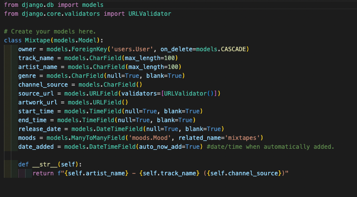

I then created the views and urls, so that I could start to do some initial basic testing on the data flow.  Initially, I just started with a GET all for the /api/mixtapes/ view and tested the request in Insomnia to make sure the data comes back, and then quickly moved on to expanding the GET single id of mixtape, as well as POST, PUT and DELETE methods.

I then created a populated serializer to connect the many-to-many relationship with the mood and mixtapes tables, so that I could show a populated view of moods when querying a single mixtape or all.

I swiftly moved onto creating the login and register routes and extended the authentication with secure routes.  This included an integration with JSON Web Tokens (JWT) which I then tested by passing the token data as part of the request in the header in Insomnia.  By now, I had a really good basic way of testing the various request methods in Insomnia, which looked like this:

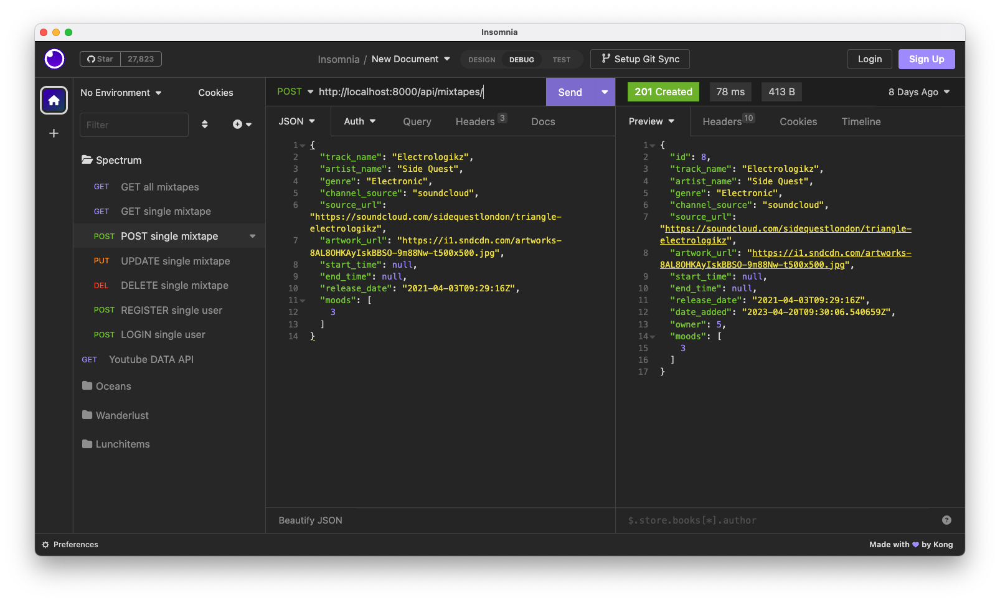

I added exceptions in the lib file to capture errors better when I was testing.  Within the first 3 days, I had pretty much the majority of the server-side work completed, with all request methods tested thoroughly to make sure they were working as intended.  It went a lot more smoothly than I had initially thought!

**Days 4, 5, & 6: front-end work**

The following days were about creating the front-end and then linking up with the back-end work I had previously done.  I installed React and all the necessary packages to set up the client folders, and then got the data being fed into the app using an axios GET request. 

I then set up the structure of the homepage JSX and started to map out some of the data on a grid.  I had found some really awesome UI components on codepen that I wanted to use as part of the retro / modern aesthetics.  This included an LED screen and some neumorphic-designed components that I started to lay down on the homepage to control the audio:

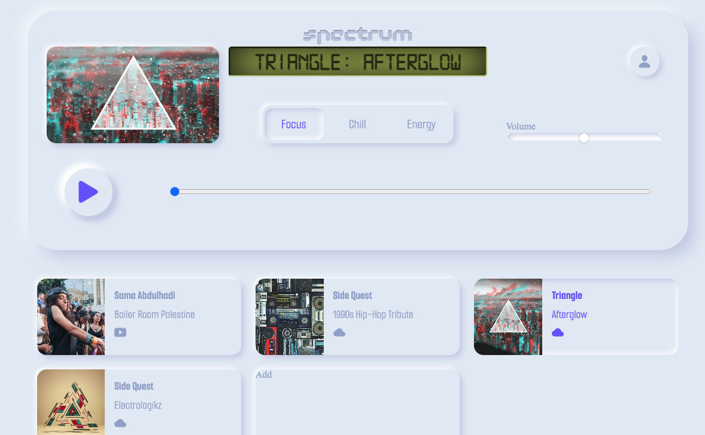

At this point, I was beginning to be really happy with the design ethos of the app, even though a few of the controls needed additional styling.  I built the SASS in a way that is very reusable, and if I wanted to change the colour scheme through the UI, I could do so by changing a few global root variables, as I referenced these throughout the SASS:

```
:root {
 --primary-light: #8abdff;
 --primary: #6d5dfc;
 --primary-dark: #5b0eeb;
  --white: #FFFFFF;
 --greyLight-1: #E4EBF5;
 --greyLight-2: #c8d0e7;
 --greyLight-3: #bec8e4;
 --greyDark: #9baacf;
}


$container-shadow: .8rem .8rem 1.4rem var(--greyLight-2),
-.2rem -.2rem 1.8rem var(--white);
$shadow: .3rem .3rem .6rem var(--greyLight-2),
-.2rem -.2rem .5rem var(--white);
$inner-shadow: inset .2rem .2rem .5rem var(--greyLight-2),
inset -.2rem -.2rem .5rem var(--white);


$brand-font: "AtAmiga-Regular";
// $main-font: "Share Tech Mono", monospace;
$main-font: 'Smooch Sans', sans-serif;
```

I also created the user login and registration flow on 1 page (rather than separate routes) which worked out really well:

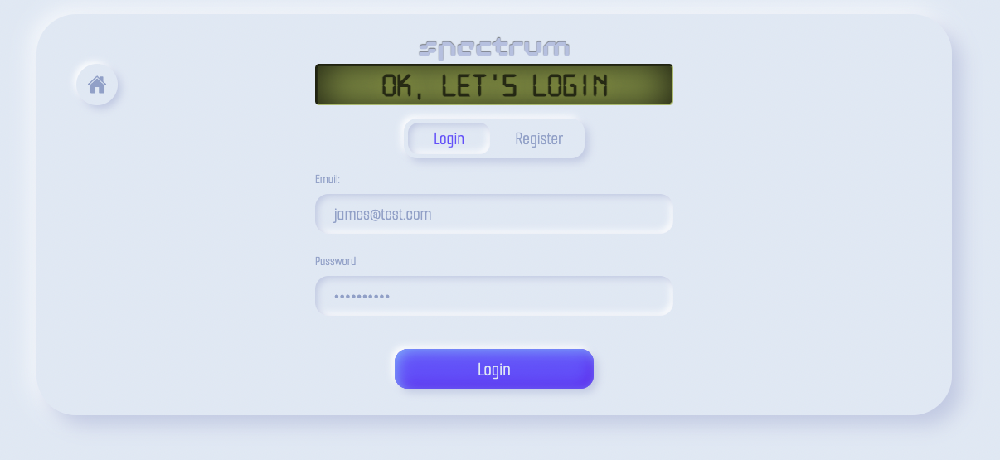

I started to use the LED screen to inject a bit of personality into the app, like an AI speaking to the user, and it also doubled up like a console log, as I showed the error states also!

Next up was adding the mixtape to your profile page, and this was the tricky part as it meant integrating with Soundcloud and Youtube APIs.  When loading the URLs, I had a function that validated to make sure the URL was in the format of a Soundcloud, Youtube or Mixcloud link. I learnt a lot about using Regex to validate the input URLs, and then if validate, would set in the mixtapeFields state and update the LED:

```
// function called when the mixtape is loaded via 'Load' button
 // it will checked to make sure the URL is valid. if ok, sets in state for ReactPlayer to use, otherwise throws an error.
 function handleLoadClick() {
   // setMixtapeFields(initialMixtapeFields)
   const urlRegex = /^(?:(?:http|https):\/\/)?(?:www\.)?(?:soundcloud\.com|youtu(?:be\.com|\.be)|mixcloud\.com)\/.+$/   
   const isValidInputUrl = urlRegex.test(url)


   // console.log('defining url', isValidInputUrl)
   if (isValidInputUrl){


     // set valid URL to show in ReactPlayer
     setValidatedUrl(url)


     // check channel source of URL and add to state along with the URL
     const channelSource = checkChannelSource(url)
     setMixtapeFields({
       ...mixtapeFields,
       source_url: url,
       channel_source: channelSource,
     })
    
     // set success message
     setLedText('Sick mix ;-)')
   } else {
     setLedText('Please enter correct URL...')
   }
 }
```

I had a separate function to handle loading the mixtape into the react-player for preview and details into state, therefore pre-populating the fields from API data.  This is an example of handling a youtube track:

```
// purpose of this function is to retrieve youtube metadata to store in state (and therefore to db once added)
 // called once the ReactPlayer is ready (onReady) and if mixtape is a youtube track
 // NOTE: this is the official youtube Data API and is really nice to use and powerful. They are open for developers :)
 function handleYTLoad() {
   const getData = async () => {
     try {
       // take validated url and identifies the unique ID of the video, to pass through to API
       console.log('url to validate ->', url)
       const youtubeUrl = new URL(validatedUrl)
       const videoId = youtubeUrl.searchParams.get('v')
       console.log(videoId)
      
       // get the youtube API data from the unique ID
       const { data } = await axios.get(`https://www.googleapis.com/youtube/v3/videos?id=${videoId}&key=${youTubeKey}&part=snippet,contentDetails,statistics,status`)
      
       // store data to state
       const { items: [{ snippet }] } = data
       setMixtapeFields({
         ...mixtapeFields,
         track_name: snippet.title,
         artist_name: snippet.channelTitle,
         // genre: snippet.genre,
         artwork_url: snippet.thumbnails.medium.url,
         // end_time: snippet.duration,
       })


     } catch (err) {
       console.log('didnt load data!', err)
     }


   }
   getData()
 }
```

<!-- Days 7 and 8 -->

The final two days were wrapping things up and putting the final touches to the application, and doing extensive testing to ensure it was working as expected.  This was quite a mad rush towards the finishing line!

This included things such as:
- Add the filtering of mixtapes according to mood
- Changing the ‘GET all’ method to just GET mixtapes created by the owner
- Adding a profile page with the ability to delete mixtapes from their profile
- Improving mobile responsive breakpoints
- Additional styling of the volume and progress bars, adding start and end time functionality
- Additional error states
- Adding a favicon, improving font legibility and design tweaks

<h3>Final result</h3>

The homepage:


Adding a mixtape (fields being pre-populated by the APIs once loaded):

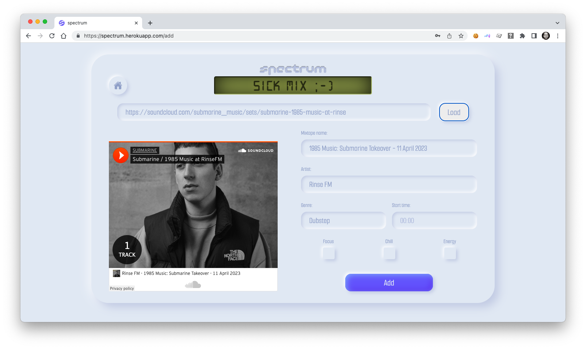

Managing your profile (updating details and deleting tracks):

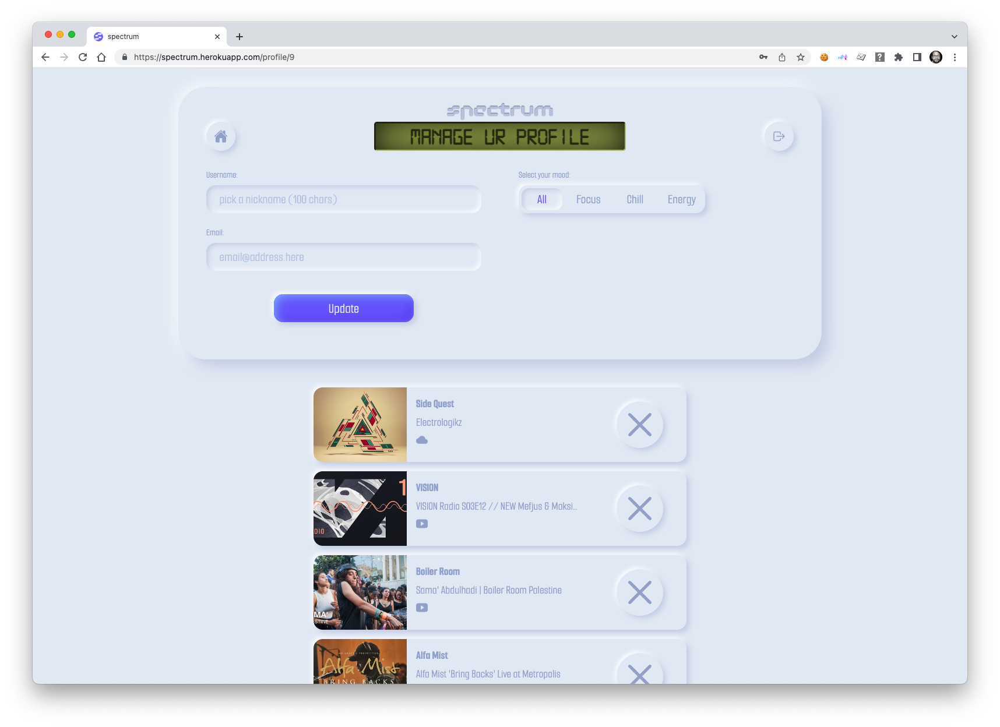

<h2>Challenges</h2>

**1st challenge:**  I think the hardest challenge was integrating properly with the third-party dependencies, as I was at the mercy of the provided APIs.  Youtube was less of an issue, but the way I had to integrate with Soundcloud’s Widget API felt a little hacky, and not ideal.  One of the problems encountered when I was trying to load in the Soundcloud track data when adding a mixtape, was that the data was not ready in the react-player before it could be ingested in the fields.  The widget was slow in processing the data.  I got around this by using the ‘onReady’ method provided by the react-player itself, and then triggering the useEffect when the player was ready or not:

```
<ReactPlayer className="react-player"
  url={validatedUrl}
  onReady={() => setPlayerReady(true)}
  // ref={reactPlayerRef}
  volume={0.5}
  width='100%'
  height='100%'
  config={{
    youtube: {
      options: { visual: false, show_artwork: false },
    },
  }}
/>
```

```
// Once the player has loaded properly, and is ready, then we read and save the data to state.
 // allows user to load a new track also (thus validatedUrl changes and triggers)
 useEffect(() => {
   if (playerReady && validatedUrl) {
     if (mixtapeFields.channel_source === 'soundcloud'){
       handleSCLoad()
     } else if (mixtapeFields.channel_source === 'youtube') {
       handleYTLoad()
     }
   }
 }, [playerReady, validatedUrl])
 ```
 
**2nd challenge:**  When deploying to heroku, there was an issue with playing Youtube videos across the site, which took a while to resolve. When you add an embedded iframe for a youtube video, the referrer (the host origin where the video is being played) is sent to youtube, by the scripts inside the iframe (the embed url gets a new page which brings all the required scripts). If the server is setting a referrer policy which prevents the communication about the referrer, youtube rejects the play request and responds with 204 - no content.  Fortunately, I found a fix for this on stack overflow which fixed it, although it took quite a lot of research in finding a solution for this one!

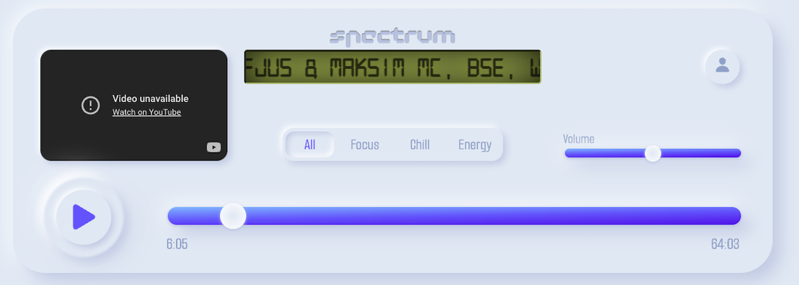
```
# fix for youtube videos not appearing correctly when deployed to heroku
SECURE_REFERRER_POLICY = "no-referrer-when-downgrade"
```

**3rd challenge:** I ran into an issue with authentication when I changed from displaying all mixtapes (GET all) to only showing mixtapes by owner only.  I got a Forbidden: /api/mixtapes/ error message: 

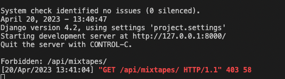

When I tried in Insomnia, it worked perfectly by adding an authorization header, however in the app itself, it didn’t work. It turns out that I forgot to add the appropriate authentication in the app request itself, and instead was doing a standard axios request.  Changing the request for an authenticated one fixed it instantly:

```
useEffect(() => {
   const getData = async () => {
     try {
       if (isAuthenticated()){
         const { data } = await authenticated.get('/api/mixtapes/')
         setMixtapes(data)
         console.log(data)
       }
     } catch (err) {
       console.log(err)
     }
   }
   getData()
 }, [])
```


